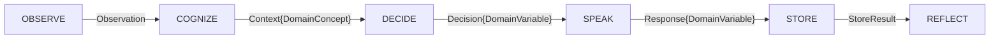

# 01_loop_execution — 认知循环执行规范

**层级：L1（执行层规格）**
**依据：** L0 core_essence/02_minimal_cognitive_loop.md

---

## 一、循环结构

### 1.1 6 步执行序列

```
OBSERVE → COGNIZE → DECIDE → SPEAK → STORE → REFLECT → [回到 OBSERVE]
```

所有 6 步按顺序执行，不可跳过或重排。

### 1.2 降级豁免

在以下条件下可跳过特定步骤：

| 条件 | 允许跳过的步骤 | 理由 |
|------|--------------|------|
| 空输入（EmptyObservation） | SKIP: COGNIZE / DECIDE / SPEAK → 直接进入 STORE | 无内容可认知，但空输入仍须记录（不变量 req） |
| REFUGE 模式 | SKIP: COGNIZE（深度）/ DECIDE / SPEAK | 系统处于深度修复状态，固定响应优先 |
| OBSERVE + STORE 不跳过 | 永远 | L0 不变量：感知 + 存储必须配备 |

### 1.3 状态传递



每一步产生一个域变量（DomainVariable），传递给下一步。域变量的格式由各步的 reducer 规范定义。

---

## 二、Reducer 规范（函数式纯粹性）

### 2.1 每个 step 是一个 Reducer

每个 step 定义一个 reducer——一个纯函数式映射关系：

```
Reducer: (previous_state, step_input) → (new_state, step_output)
```

**Reduer 的属性：**

| 属性 | 要求 | 违反处理 |
|------|------|---------|
| 确定性 | 相同输入 + 相同 previous_state → 相同输出 | LAYER_VIOLATION |
| 无副作用 | reducer 不写入文件、不调外部 API、不修改全局状态 | L2 拦截 |
| 无状态泄漏 | reducer 输出不包含 L1 实现细节 | 接口检查 |
| 语义域纯净 | 只处理属于自己的语义域内容 | loop_soundness 证明 |

### 2.2 函数签名格式（L1 规格级）

每个 reducer 的规格应描述：

```
## 【step_name】Reducer

### 输入
- State(t): IterationState（当前 L0 定义的 State 结构）
- [step-specific input]: 上一步产生的 DomainVariable

### 输出
- State(t+)：更新后的 State（可能有部分字段变化）
- [step_name]_output: 传递给下一步的 DomainVariable

### 转移规则
- [规则 1]：[纯逻辑描述]
- [规则 2]：[纯逻辑描述]

### 不变量
- [不变量 1]：此步不修改 XXX
- [不变量 2]：此步输出的 XXX 必须满足 L0 边界
```

### 2.3 各步语义域所有权

| Step | 拥有的语义域 | 可以访问 | 不可以访问 |
|------|-------------|---------|-----------|
| OBSERVE | Observation（原始输入的标准化表示） | L0 State（只读 meta） | State 其他维度、Block Store |
| COGNIZE | Context（认知上下文 + recall items） | State（只读）、Block Store（只读 recall） | 外部 API、文件写 |
| DECIDE | Decision（策略选择） | State（只读 identity/projectors）、Context | Block Store 写、外部 API |
| SPEAK | Response（输出内容） | Decision（只读） | State 写、Block Store 写 |
| STORE | StoreResult（存储确认） | State（只读）、Response（只读） | Decision 修改 |
| REFLECT | Narrative + Belief Delta + Self-model 调优 | State（只读 + 可调整 identity_projectors）、Trace（只读） | Block Store 写（由 CEO OBSERVE 步在下一轮触发 STORE 写） |

---

## 三、无输入行为

### 3.1 IDLE 行为

当系统无输入（EmptyObservation）时：

1. **OBSERVE** 必须执行（感知"无输入"这个事实）
2. OBSERVE 输出 EmptyObservation 后，**不允许进入 COGNIZE**
3. 直接跳转到 **STORE**（记录空周期）
4. **REFLECT** 应执行，调整 identity_projectors（无交互也应该缓慢收敛）

### 3.2 IDLE 循环频率

IDLE 循环的间隔由外部调度器控制（不属 L1 定义范围）。

---

## 四、步失败处理

### 4.1 单步失败不终止循环

| 失败步骤 | 传播策略 | 对 State 的影响 |
|---------|---------|---------------|
| OBSERVE 失败 | 使用空 Observation | State 不更新 |
| COGNIZE 失败 | 尝试使用上一轮的 context | State 保留上一轮值 |
| DECIDE 失败 | 默认策略 = SPEAK | State 不更新 |
| SPEAK 失败 | 空输出（空字符串或固定兜底） | State 不更新 |
| STORE 失败 | 异步重试 1 次，失败后丢弃（不可让循环阻塞） | State 推进（至少 meta 字段更新） |
| REFLECT 失败 | 跳过本轮 REFLECT（L0 不变量允许） | State 不调整 |

### 4.2 失败传递给 L2

当任何 reducer 输出 `status: failed` 时，该状态的异常信号传递给 L2 漂移检测器。L2 决定是否需要降级（见 l2_stability_spec）。

---

## 五、不在本文件范围内

| 概念 | 所属位置 |
|------|---------|
| State 的具体维度更新规则 | 02_cognitive_state.md |
| Block 的生命周期规则 | 05_memory_lifecycle.md |
| 各 reducer 的输入输出具体 DomainVariable 定义 | 各 reducer 的独立 yml 文件 |
| IDLE 的外部队列唤醒机制 | L2 stability_spec 或外部调度 |
| 多线程/并发执行 | 属实现层细节，不限 L1 |
